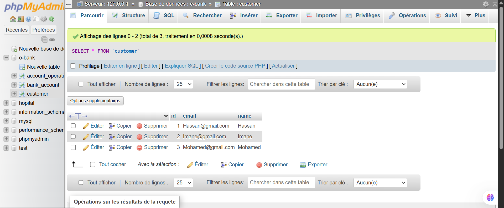

# Projet de Gestion de Comptes Bancaires

## Description du projet

Ce projet consiste à développer une application de gestion de comptes bancaires. L'application permet aux utilisateurs de gérer leurs comptes et d'effectuer des opérations de type débit ou crédit. Un compte appartient à un client et peut être de deux types : compte courant ou compte épargne.

**L'application se compose de trois parties :**

**Backend (Spring Boot) :** Création d'une API RESTful pour la gestion des comptes et des opérations bancaires.

**Frontend (Angular) :** Interface utilisateur pour la gestion des comptes et des clients.

**Sécurité (Spring Security avec JWT) :** Gestion des authentifications et des autorisations.

## Fonctionnalités principales

**Gestion des clients :** ajout, suppression, édition et recherche.

**Gestion des comptes bancaires :** création, consultation et administration.

**Enregistrement des opérations :** débit, crédit avec traçabilité des utilisateurs.

**Sécurité des comptes :** gestion des mots de passe et authentification sécurisée.

**Tableau de bord :** statistiques et graphiques avec ChartJS pour la visualisation des données.

## Architecture du projet

Le projet suit une architecture en trois couches :

**Couche de présentation :** Frontend en Angular

**Couche de service :** Backend en Spring Boot

**Couche de sécurité :** Gestion des utilisateurs avec Spring Security et JWT

## Modélisation

Les principales entités du projet sont :

**Customer :** représente un client.

**BankAccount :** compte bancaire générique.

**SavingAccount :** compte d'épargne.

**CurrentAccount :** compte courant.

**AccountOperation :** opérations effectuées sur les comptes (débit/crédit).
## Diagramme de classe:

## Développement Backend

### 1.Création d'un projet Spring Boot.

### 2.Mise en place des entités JPA : Customer, BankAccount, SavingAccount, CurrentAccount, AccountOperation.

### 3.Création des interfaces JPA Repository avec Spring Data.

### 4.Création des services, des DTOs, enumeration, exception et mappers.

### 5.Développement des contrôleurs REST.

 ## La partie base de donnée et affichage via api:

## Installation

Cloner le dépôt : git clone https://github.com/votre-projet.git

Démarrer le backend avec Maven : mvn spring-boot:run

## Auteurs

**FENNAN Salma**